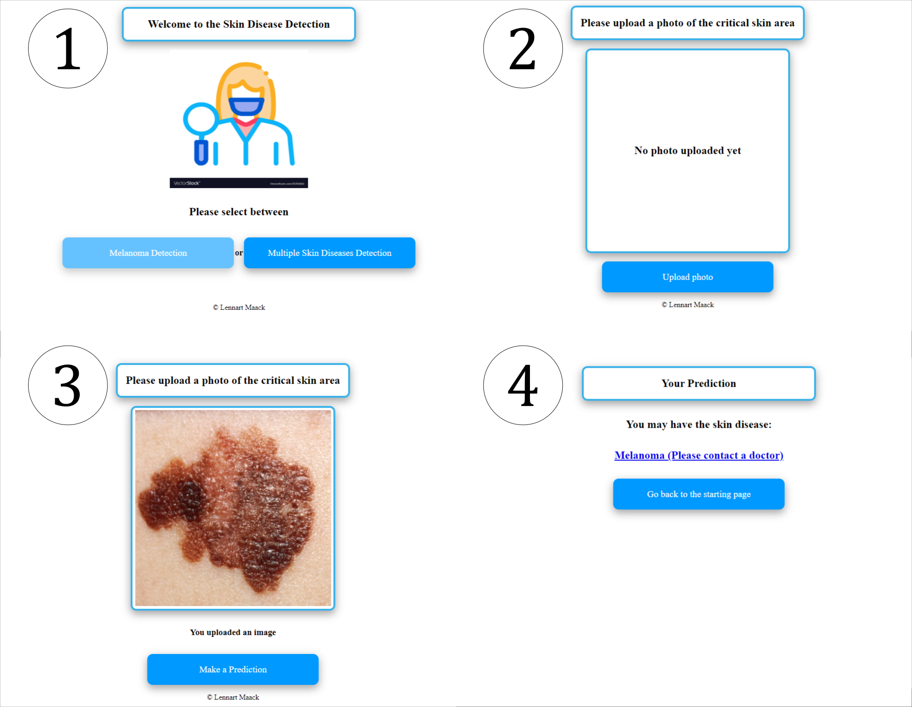

# SkinDiseaseApp <!-- omit in toc -->

## Table of Content <!-- omit in toc -->

- [Context](#context)
- [How does the App work](#how-does-the-app-work)
  - [User Interface](#user-interface)
- [Training of the model and Results](#training-of-the-model-and-results)

## Context

The App is based on the [International Skin Imaging Collaboration (ISIC) Challenge 2019](https://challenge.isic-archive.com/landing/2019/).

- The goal for ISIC 2019 is classify dermoscopic images among nine different diagnostic categories:
  1. Melanoma
  2. Melanocytic nevus
  3. Basal cell carcinoma
  4. Actinic keratosis
  5. Benign keratosis (solar lentigo / seborrheic keratosis / lichen planus-like keratosis)
  6. Dermatofibroma
  7. Vascular lesion
  8. Squamous cell carcinoma
  9. None of the others

- 25,331 images are available for training 

## How does the App work

Although the CNN model achieves overall sensitivity of 84.32% on the test set, it will probably perform poorly on your images taken by your phone. This is because:
- All images for training and testing were taken by medical experts with special equipments
- Images taken by your own phone will probably have different perspectives to the skin leasion and lenses that display the images differently

To solve these problems, more images need to be taken and the equipment that was used to take training images and test images has to be the same (equal)

### User Interface

    

##  Training of the model and Results

- Use of pretrained SEResNext50 as basemodel
- Different augmentations such as Random Horizontal Flip, Random Vertical Flip, Random Rotation and Random Color Jitter
- Use of learning rate scheduler based on area under curve (AUC) of the receriver operating characteristic curve (ROC)
- Overall sensitivity of 84.32% on test data
- This model applied on the ISIC 2019 achieved a balanced multi-class accuracy of 53.2% (ISIC 2019 Winner: 63.6%)

[Paper of the project](Skin_leasion_classification_using_cnns.pdf)